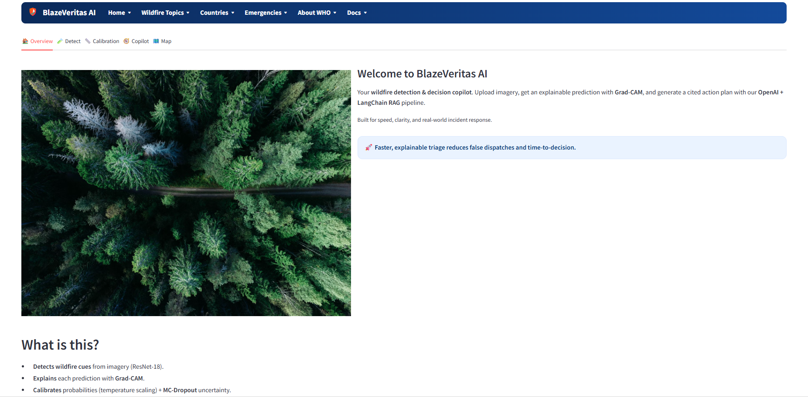
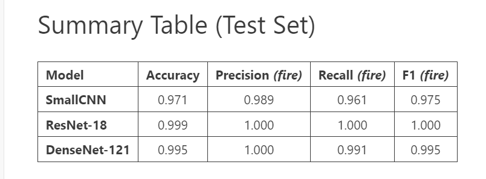
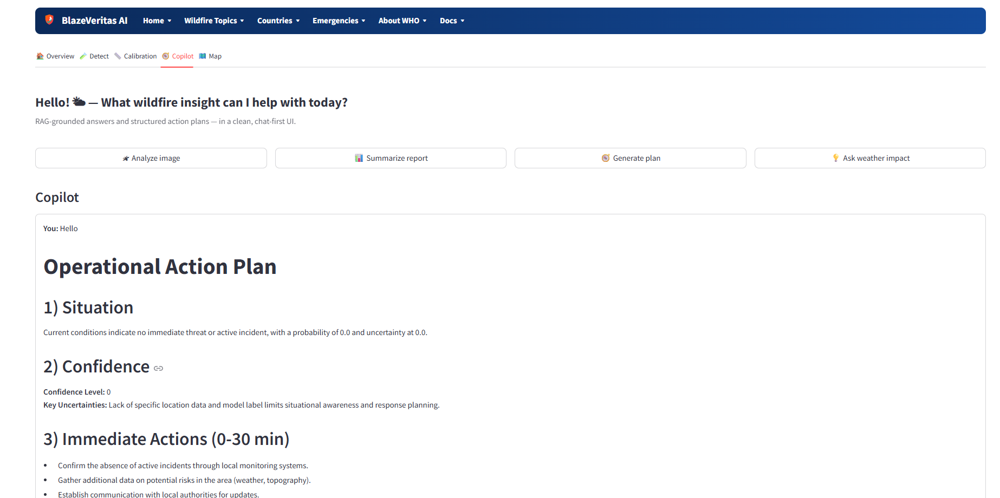

# 🔥BlazeVeritas AI — AI-Powered Wildfire Intelligence System

End-to-End Intelligent Platform for Wildfire Detection, Explainability & Response Planning

**BlazeVeritas AI** is an advanced AI system designed to detect, analyze, and explain wildfire events using deep learning, explainable AI (Grad-CAM), and retrieval-augmented reasoning (RAG).
It integrates computer vision, geospatial analytics, and conversational intelligence into a single Streamlit + FastAPI dashboard.

## 🌍 Overview
 Name Meaning — BlazeVeritas AI

The name “BlazeVeritas” comes from two powerful roots:

Blaze — symbolizing wildfire, energy, and the unpredictable forces of nature.

Veritas — Latin for truth or clarity.

Together, BlazeVeritas AI means “Truth within the Blaze.”
It reflects the project’s mission: to bring clarity, transparency, and explainable intelligence into wildfire detection and response — turning chaos into actionable insight through the power of responsible AI.

Wildfires pose catastrophic threats to ecosystems, infrastructure, and human lives.
BlazeVeritas AI bridges science and technology to deliver:
## Used dataset: 
https://data.mendeley.com/datasets/fgvscdjsmt/4 

🧠 Deep Learning–based Fire Detection from aerial or satellite imagery

🌡 Uncertainty Calibration to quantify model confidence

🎯 Explainable AI (Grad-CAM) for transparent visual reasoning

📚 RAG-Driven Copilot that provides operational action plans grounded in documents and weather data

🗺 Geospatial Visualization of predictions and hotspot regions

⚙️ System Architecture

## Streamlit UI (app.py)

├── Detect tab → CNN/ResNet/DenseNet models for fire classification

├── Calibration tab → Reliability plots & temperature scaling

├── Copilot tab → RAG assistant with OpenAI + LangChain

└── Map tab → Geo-aware visualization

## Backend (FastAPI / LangChain)

api/

├── inference.py     → Model loading & prediction

├── explain.py       → Grad-CAM generation

├── rag/

│   ├── index.py     → Vector-DB building (Chroma)

│   └── retrieve.py  → RAG plan generation with OpenAI

├── settings.py      → Environment configs

└── main.py          → API endpoints

## Core Modules

**Module	Description**
api/inference.py	Loads trained CNN/ResNet/DenseNet models and performs prediction with temperature scaling

api/explain.py	Generates Grad-CAM heatmaps for visual explainability

api/rag/retrieve.py	LangChain + OpenAI Copilot for contextual wildfire action planning

app/app.py	Streamlit dashboard integrating all components

scripts/ingest_docs.py	Indexes documents into Chroma vector store for RAG retrieval

models/	Trained model weights (.pt / .ckpt) for all backbones

## Models & Explainability
🔹 CNN Baseline

A lightweight convolutional network for rapid inference on small devices.

🔹 ResNet-18

Residual network ensuring deeper feature extraction and stable gradients.

🔹 DenseNet-121

High-accuracy model for detailed spatial reasoning with dense connectivity.

🔹 Grad-CAM Explainability

Provides per-pixel attention heatmaps highlighting why the model detected fire.

Copilot (RAG Assistant)

The BlazeVeritas Copilot combines:

🔎 Chroma Vector Store for semantic retrieval of wildfire documents

💬 OpenAI LLM (GPT-4o mini / gpt-3.5-turbo) for structured action plans

🌦 Contextual Tools — Weather, NDVI, Topography

Example Query

“What are the immediate risks near the detected area?”

Copilot Response:

Situation summary

Confidence & uncertainties

Immediate actions (0–30 min)

Next steps (2–6 hr)

Key risks

Public communication guidelines

Source citations

**Calibration & Reliability**

Implements Temperature Scaling and Expected Calibration Error (ECE)
to ensure probabilistic outputs reflect true model confidence — critical for
real-world emergency decision-making.

**Geospatial Visualization**

Integrates coordinates from predictions (lat, lon)

Future support for NASA FIRMS, Sentinel-2, and Earth Engine data streams

Enables mapping of fire hotspots and uncertainty regions

## Tech Stack

Layer	Technology

Frontend	Streamlit 1.36 (UI + Interactivity)

Backend API	FastAPI + Uvicorn

AI Models	PyTorch, TorchVision

Explainability	Grad-CAM, Matplotlib

RAG / LLM	LangChain, OpenAI API, Chroma VectorDB

Utilities	NumPy, Pandas, Requests, dotenv

# 1️⃣ Clone the repository
git clone https://github.com/dilrabonu/BlazeVeritas-AI.git
cd BlazeVeritas-AI

# 2️⃣ Create and activate environment
python -m venv .venv
.venv\Scripts\activate  # Windows
# or
source .venv/bin/activate  # Linux/Mac

# 3️⃣ Install dependencies
pip install -r requirements.txt

# 4️⃣ Set environment variables
# Inside .env
OPENAI_API_KEY=your_api_key_here

# 5️⃣ Launch FastAPI backend
uvicorn api.main:app --host 0.0.0.0 --port 8000 --reload

# 6️⃣ Run the Streamlit dashboard
streamlit run app.py

**Results Snapshot**

## Example Use Case

Upload a wildfire image → model classifies “FIRE / NO FIRE”

Grad-CAM overlay reveals hot zones of activation

Copilot analyzes weather + terrain + RAG documents

Generates a structured action plan with citations

Displays plan and heatmaps on the dashboard

## Deployment Plan

✅ Local FastAPI + Streamlit prototype

☁️ Cloud deployment via Azure  (coming soon)

🛰 Integration with real-time satellite feeds

🔗 RAG expansion to climate and emergency datasets

## 👩‍💻 Authors & Responsibilities

### **Dilrabo Khidirova**
**Role:** AI Engineer | MSc in Machine Learning & Data Science  
**Responsibilities:**
- Designed and implemented the **AI model pipeline** (DenseNet121, ResNet18).  
- Developed **Grad-CAM explainability** and **uncertainty estimation** modules.  
- Built the **Streamlit dashboard** and integrated the **RAG Copilot (LangChain + OpenAI)**.  
- Led **dataset preprocessing**, **model calibration**, and **FastAPI backend** development.  
- Authored project documentation and technical report for **EPAM Internship**.

  ### **Anna Surkova**
**Role:** Project Manager | Data Engineering & AI  
**Responsibilities:**
- Coordinated the **project roadmap** and milestone delivery.  
- Managed **data engineering workflows** and validation pipelines.  
- Oversaw **testing, documentation, and deployment strategy**.  
- Supported integration between AI models and front-end dashboard.  
- Provided strategic guidance on **AI ethics and reliability assessment**.

## Acknowledgments

EPAM Systems Mentorship (2025) — Internship project under Taras Ustyianovych & Yulyana Huliayeva

IT Park University — Research Guidance on AI for Wildfire Detection

OpenAI & LangChain Teams — for powerful LLM and retrieval frameworks

License

MIT License © 2025 Dilrabo Khidirova
